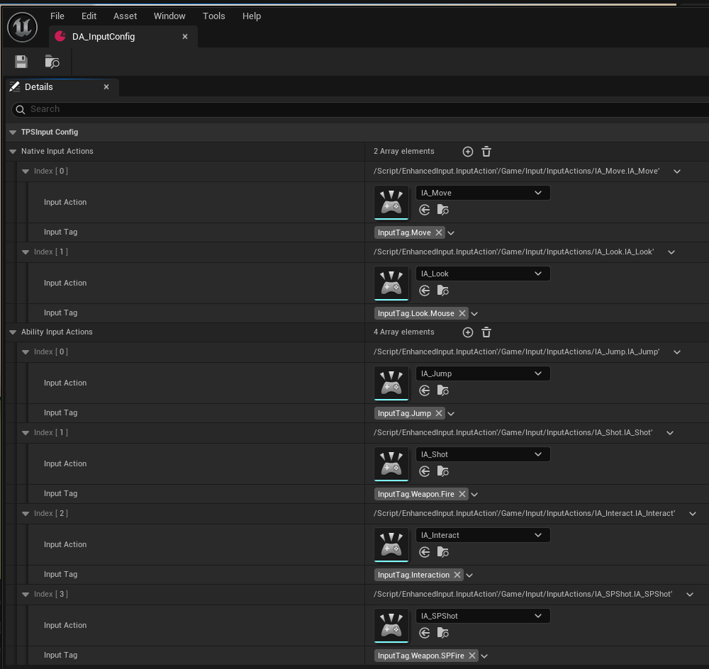
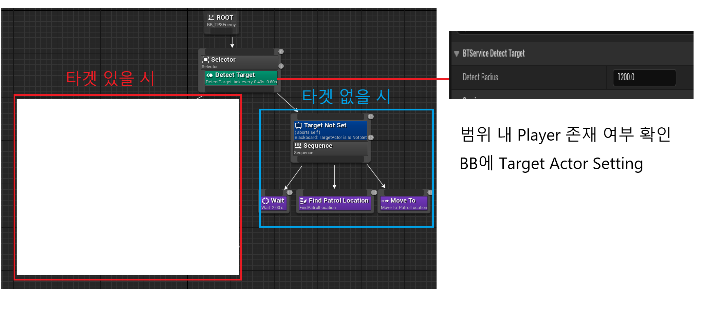
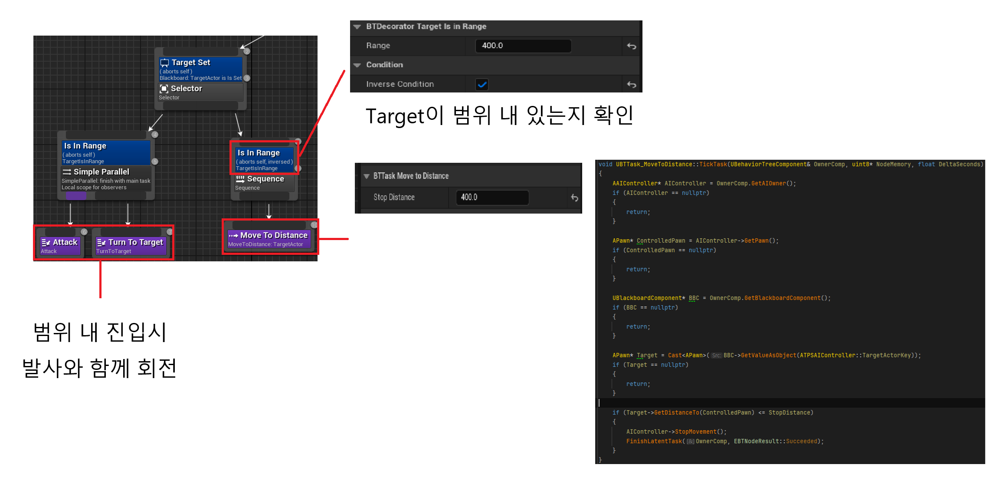

정리 Slide : https://docs.google.com/presentation/d/1OZ-jnF9TqLvEYXjug0RYpU7S4z75fitwBm7maFgsNM0/edit?usp=drive_link

Code convention
- Base : https://dev.epicgames.com/documentation/en-us/unreal-engine/epic-cplusplus-coding-standard-for-unreal-engine
- 개인 규칙
  - 멤버 함수, 변수 작성 순서 : 멤버 함수 우선 작성
  - static, const는 일반 멤버 변수와 함수보더 앞에 온다.
  - Access 별 작성 순서 : public, protect, private
  - 같은 Access 내에서 엔진 Func들의 호출 Flow가 있을 경우 해당 Flow에 맞게 순서를 지킨다.
  - if를 사용 시 무조건 scope를 생성한다.
  - if state 확인 시 true, nullptr 등 상세 히 조건을 적는다.

작업 기간 : 24.12 ~  
작업 인원 : 1인  
작업 환경 : UE 5.5, Rider, Git  
사용 플러그인 : GAS  

개발 정리 블로그 : https://blog.naver.com/yoon20002000/223755810465

영상

Input
- Data Asset에 Input 및 Tag 정의

- Enhanced Input과 GAS Tag를 기준으로 Ability Bind

- Native Bind와 Ability Bind로 구분

- PostProcessInput로 Bind 된 Tag가 있는지 확인 후 처리 진행

Player
- 이동(WASD)
- 점프(Space)
- 공격(ML)

- 특수 공격(MR)
- 특수 공격 사용시 이동 불가 및 Cost로 HP 15 사용

- 상호 작용(F)
- 상호 작용을 통해 Field에 배치 된 Interaction Actor와 상호작용

Interaction Actor
- 상호작용하여 상호작용 대상에게 적용할 GE 들을 보유
- 정상적으로 상호작용 Activate 성공 시 보유 중인 GE를 이용해 적용
- 아래는 상호작용 시 Heal을 해주는 Actor

AISpawner
- AICharacter를 특정 주기에서 Field에 특정 수치만큼 계속 Spawn 하게 함.

AI Behavior Tree
- 범위 내 Player 존재 확인 후. 존재 시 BB에 Setting

- 공격 사정거리 외에도 이동 사정거리 설정 가능하게 제작작

Indicator UI
- 적 HP와 Name 표시를 위한 Indicator

- Interaction Actor의 설명을 표시하기 위한 Indicator

- 필요한 Indicator가 있을 경우 확장 가능하도록 설계 및 구현

UTPSIndicatorDescriptor : Indicator 처리 데이터 Class
UTPSIndicatorManagerComponent : UTPSIndicatorDescriptor 기반 Indicator 등록 및 해제 관리

UTPSNameplate : Nameplate Widget Class
UTPSNameplateSource : Nameplate 표현을 위한 추가 데이터 및 Nameplate관리 Manager를 통해 Indicator 등록 및 해제
UTPSNameplateManager : NameplateSource를 기반으로 UTPSIndicatorDescriptor를 생성하여 UTPSIndicatorManagerComponent에 등록 및 해제 관리

UTPSInteractionIndicatorWidget : Interaction Widget Class
UTPSInteractionIndicatorComponent : 플레이어와 상호작용 가능한 Interaction Actor를 확인하여 해당 Actor에 저장된 Description을 기반으로 UTPSIndicatorDescriptor 생성, UTPSIndicatorManagerComponent에 등록 및 해제 관리

STPSActorCanvas : Slate를 이용해 Indicator UI 처리  
UTPSIndicatorLayer : STPSActorCanvas를 이용해 Indicator UI를 표시할 Widget

Inventory System
- IA_Inventory를 이용해 GA_Inventory를 Active 하여 Inventory Open
- 획득, 사용, 제거, 교체 기능 보유
- 획득은 기존 IA_Interaction을 통해 진행
- 사용은 Use를 이용해 사용
- ex) 포션을 사용 해 체력 회복
- Drop1 시 한 개 씩, Drop All 시 전체를 한 패키지로 제거
- 가방을 보유 중인 Container Actor에 Item 이동 가능
- Drag Drop을 이용해 교체, Stack 병합, 제거 지원
- 아이템 획득

- 아이템 사용 : 체력 회복 포션

- 아이템 제거 

- 아이템 이동

- 아이템 교체

- 아이템 병합 및 교체체

